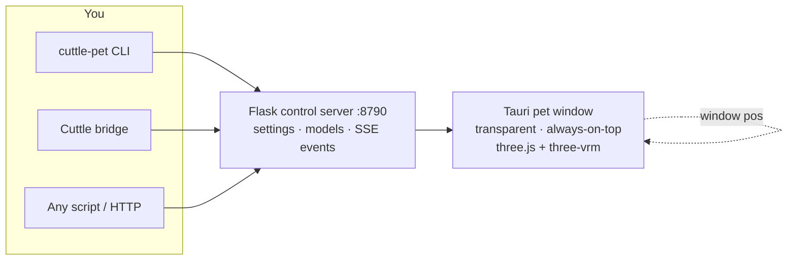

<div align="center">

# Cuttle Pets

**A transparent, always-on-top 3D desktop pet that reacts to your coding agents in real time.**

When Cuttle works, she types. When it's done, she cheers. When tests go green, she tells you.

[Quick start](#quick-start) · [What she does](#what-she-does) · [Cuttle bridge](#cuttle-bridge) · [Control API](#control-api) · [Models & animation](#models--animation) · [Building](#building)

[](LICENSE.txt) [](#requirements) [](#requirements) [](#building)

<br>


</div>

> [!NOTE]
> **A companion to [Cuttle](https://github.com/kidchemical/Cuttle), not a part of it.** The pet is a separate app with no dependency on the Cuttle daemon — it keeps running even if Cuttle restarts. It also works fully standalone: drive it from any script over HTTP or the CLI.

## What she does

| Moment | Reaction |
| --- | --- |
| Agent starts thinking | Ponders, types at her tiny laptop |
| Agent streams code | Typing pose with beat-synced head nod while music plays |
| Work finishes | Cheers, waves, or dances |
| Tests go green | Tells you in a speech bubble |
| You go idle / lock the screen | Steps away — render loop stops, window hides |

<div align="center">

| Wave hello | Typing while you work |
| --- | --- |
|  |  |


<sub>Captures from a live pet. Swap in your own VRM model and she keeps every trick.</sub>

</div>

## Quick start

### Requirements

- Linux (tested), Windows, or macOS
- Python 3.11+ with Flask (`pip install -r requirements.txt`)
- Node 20+ and Rust (for the Tauri window — see [Building](#building))
- A `.vrm` model — author one free in [VRoid Studio](https://vroid.studio), or start with the bundled sample
- Optional: Cuttle running locally, if you want her to react to agent chats

### Run it

```bash
# 1. control server (the only thing the pet window talks to)
python3 server/server.py            # http://127.0.0.1:8790

# 2. the pet window
cd app && npm install && npm run tauri dev

# 3. say hi
python3 ../cli/cuttle_pet.py say "Hello from the terminal!" --emotion happy
```

Or launch everything at once on Linux:

```bash
bash start_pet.sh
```

### Try it

```bash
python3 cli/cuttle_pet.py status
python3 cli/cuttle_pet.py emote surprised --intensity 0.8
python3 cli/cuttle_pet.py action greeting
python3 cli/cuttle_pet.py event thinking --detail "Reading three files…"
python3 cli/cuttle_pet.py event done --detail "Test complete!"
python3 cli/cuttle_pet.py watch      # stream pet events to stdout
```

## Architecture



| Path | Purpose |
| --- | --- |
| `app/` | Tauri + React + three.js renderer (vendored from [claw-sama](https://github.com/luckybugqqq/claw-sama), MIT — see `app/VENDORED.md`) |
| `server/server.py` | Flask control server — the only thing the pet window talks to |
| `cli/cuttle_pet.py` | `emote` / `action` / `say` / `event` / `click-through` / model import |
| `bridge/` | Polls Cuttle live-status and drives pet reactions |
| `models/` | Your `.vrm` files (gitignored — never shipped) |
| `scripts/autostart.py` | Linux desktop-login autostart |

## Cuttle bridge

The bridge watches **all chats on your Cuttle account** (batched, every 3 seconds) and turns activity into reactions: thinking → ponders, streaming → types, done → celebrates, then back to idle. It's an activity indicator — it never reads or speaks full replies.

```bash
bash start_pet.sh   # includes the bridge
```

Then open the pet's **Settings → Cuttle → Connect to Cuttle** and sign in once with your normal Cuttle username and password. The pet keeps a separate login session (owner-only file, token not password) and reconnects itself after reboots. Restrict to specific chats when you want:

```bash
python3 bridge/bridge.py --session 868 --session 869 --verbose
CUTTLE_PET_BRIDGE=0 bash start_pet.sh   # no bridge, direct CLI control only
```

## Control API

The server is plain HTTP on `127.0.0.1:8790` — anything can drive her:

| Verb | Effect |
| --- | --- |
| `GET /events` | **SSE** — the only inbound channel to the pet |
| `POST /emote` | `emotion`, `emotionIntensity`, `emotionDuration` — set expression |
| `POST /action` | `action`, `hold` — play a named animation |
| `POST /say` | `text`, `emotion` — speech bubble + lip-sync |
| `POST /pet/event` | `state` (`thinking`/`streaming`/`done`/`error`/`idle`) + `detail` — chat-activity reaction |
| `POST /clear` | Clear the bubble |
| `POST /click-through` | Toggle mouse pass-through |
| `GET/POST /settings` | Renderer settings store |
| `GET /model/list`, `POST /model/import` | Manage models |

Emotions: `happy sad angry surprised think awkward question curious neutral love flirty greeting relaxed`.
Actions: `akimbo playFingers scratchHead stretch happy angry greeting excited shy point salute angryPump`, plus Mixamo and Quaternius dance packs.

## Models & animation

Use **VRM** (`.vrm`) — export free from [VRoid Studio](https://vroid.studio), or from Unity via [UniVRM](https://github.com/vrm-c/UniVRM) (MIT). Import with `cuttle-pet models --import file.vrm`.

Bundled motion: 10 Mixamo clips (Adobe free account terms), the CC0 [Quaternius](https://quaternius.com) animation libraries (sitting, talking, phone call, dance), and CC0 hand props (laptop, phone, coffee cup — the cup appears for a ~4s sip every minute or so of sustained work). Beat sync nods along to your music via PipeWire, with MPRIS fallback.

Full provenance for every bundled binary lives in [`docs/ASSET_LICENSES.md`](docs/ASSET_LICENSES.md) — code is MIT, assets keep their own terms.

## Window & desktop

Transparent, always-on-top, no decorations, skipped taskbar — drag her anywhere, Tab folds the menu, F4 settings, F5 reload. Position restores on launch (Xwayland shim on Wayland). She pauses her render loop and hides on screensaver/lock. Enable login autostart with `python3 scripts/autostart.py enable`.

## Development

```bash
python3 -m pytest tests/          # Python suite (server, bridge, beats)
cd app && npx tsc --noEmit        # renderer typecheck
```

## License

MIT. See [`LICENSE.txt`](LICENSE.txt). The renderer in `app/` is upstream [claw-sama](https://github.com/luckybugqqq/claw-sama) work under MIT — `app/UPSTREAM-LICENSE.txt` stays intact. Bundled models, motions, and props keep their own terms ([asset licenses](docs/ASSET_LICENSES.md)).
