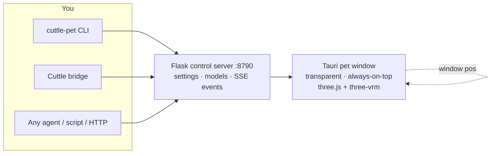

<div align="center">


**A transparent, always-on-top 3D desktop pet that reacts to your coding agents in real time.**

When Cuttle works, she types. When it's done, she cheers. When tests go green, she tells you.

[Quick start](#quick-start) · [What she does](#what-she-does) · [Any agent can drive her](#any-agent-can-drive-her) · [Cuttle bridge](#cuttle-bridge) · [Control API](#control-api) · [Models & animation](#models--animation) · [Windows](#windows) · [Building](#building)

[](LICENSE.txt) [](#requirements) [](#requirements) [](#building)

<br>


</div>

> [!NOTE]
> **A companion to [Cuttle](https://github.com/kidchemical/Cuttle), not a part of it.** The pet is a separate app with no dependency on the Cuttle daemon — it keeps running even if Cuttle restarts. It also works fully standalone: any agent, script, or shell can drive it over HTTP or the CLI.

## What she does

| Moment | Reaction |
| --- | --- |
| Agent starts thinking | Ponders, types at her tiny laptop |
| Agent streams code | Typing pose with laptop, coffee mug, and speech bubble |
| Work finishes | Cheers, waves, or dances |
| Tests go green | Tells you in a speech bubble |
| Music plays on your desktop | Headphones on, beat-synced nod (Ubuntu/PipeWire or Windows/WASAPI) |
| Your cursor moves | Eyes and head follow it |
| You lock the screen | Steps away — render loop stops, window hides |

<div align="center">

| Wave hello | Typing while you work |
| --- | --- |
|  |  |

| Music reactions | She watches your cursor | Dance break |
| --- | --- | --- |
|  |  |  |


<sub>Captured from a live pet against a transparent background. Swap in your own VRM model and she keeps every trick.</sub>

</div>

## Quick start

### Requirements

- Linux (tested), Windows, or macOS
- Python 3.11+ with Flask (`pip install -r requirements.txt`)
- Node 20+ and Rust (for the Tauri window — see [Building](#building))
- A `.vrm` model — author one free in [VRoid Studio](https://vroid.studio), or start with the bundled sample
- Optional: Cuttle running locally, if you want her to react to agent chats

### Run it

```bash
# 1. control server (the only thing the pet window talks to)
python3 server/server.py            # http://127.0.0.1:8790

# 2. the pet window
cd app && npm install && npm run tauri dev

# 3. say hi
python3 ../cli/cuttle_pet.py say "Hello from the terminal!" --emotion happy
```

Or launch everything at once:

```bash
bash start_pet.sh                     # Linux
powershell -ExecutionPolicy Bypass -File .\start_pet.ps1   # Windows
```

On Linux with the NVIDIA driver loaded, the app defaults to WebKitGTK's
DMA-BUF compatibility fallback to avoid a known graphics-driver crash path.
This applies to direct binary launches too. An explicit
`WEBKIT_DISABLE_DMABUF_RENDERER` environment value overrides the default
(`0` opts back into DMA-BUF). The fallback can affect rendering performance
and transparency; see [Tauri's NVIDIA compatibility report](https://github.com/tauri-apps/tauri/issues/9394).

### Try it

```bash
python3 cli/cuttle_pet.py status
python3 cli/cuttle_pet.py say "Hello!" --emotion happy
python3 cli/cuttle_pet.py emote surprised --intensity 0.8
python3 cli/cuttle_pet.py action greeting
python3 cli/cuttle_pet.py event thinking --detail "Reading three files…"
python3 cli/cuttle_pet.py event done --detail "Test complete!"
python3 cli/cuttle_pet.py watch      # stream pet events to stdout
```

## Any agent can drive her

The control surface is plain HTTP plus a stdlib-only Python CLI — no Cuttle, no API keys, no SDK. If your agent can run a shell command, it can pet:

```bash
# Claude Code, Codex, Muse Code, OpenCode, Cursor, … — all the same:
python3 cli/cuttle_pet.py event thinking --detail "Refactoring auth…"
python3 cli/cuttle_pet.py event done --detail "Ship it!"
```

or raw HTTP from any language:

```bash
curl -X POST http://127.0.0.1:8790/pet/event \
  -H 'Content-Type: application/json' \
  -d '{"state":"done","detail":"Deploy finished"}'
```

CLI exit codes are script-safe (`0` on success), so agents can chain commands reliably. The Cuttle bridge below is just one opinionated driver — bring your own for any other harness.

## Architecture



| Path | Purpose |
| --- | --- |
| `app/` | Tauri + React + three.js renderer (vendored from [claw-sama](https://github.com/luckybugqqq/claw-sama), MIT — see `app/VENDORED.md`) |
| `server/server.py` | Flask control server — the only thing the pet window talks to |
| `cli/cuttle_pet.py` | `emote` / `action` / `say` / `event` / `click-through` / model import |
| `bridge/` | Polls Cuttle live-status and drives pet reactions |
| `~/.cuttle-pet/` | Your data (never shipped): `models/` (`.vrm` library), `pets/` + `props/` (imported GLBs), `settings.json` |
| `scripts/autostart.py` | Linux desktop-login autostart |

## Cuttle bridge

The bridge watches **all chats on your Cuttle account** (batched, every 3 seconds) and turns activity into reactions: thinking → ponders, streaming → types, done → celebrates, then back to idle. It's an activity indicator — it never reads or speaks full replies.

```bash
bash start_pet.sh   # includes the bridge
```

Then open the pet's **Settings → Cuttle → Connect to Cuttle** and sign in once with your normal Cuttle username and password. The pet keeps a separate login session (owner-only file, token not password) and reconnects itself after reboots. Restrict to specific chats when you want:

```bash
python3 bridge/bridge.py --session 868 --session 869 --verbose
CUTTLE_PET_BRIDGE=0 bash start_pet.sh   # no bridge, direct CLI control only
```

## Control API

The server is plain HTTP on `127.0.0.1:8790` — anything can drive her:

| Verb | Effect |
| --- | --- |
| `GET /events` | **SSE** — the only inbound channel to the pet |
| `POST /emote` | `emotion`, `emotionIntensity`, `emotionDuration` — set expression |
| `POST /action` | `action`, `hold` — play a named animation |
| `POST /say` | `text`, `emotion` — speech bubble + lip-sync |
| `POST /pet/event` | `state` (`thinking`/`streaming`/`done`/`error`/`idle`) + `detail` — chat-activity reaction |
| `POST /clear` | Clear the bubble |
| `POST /click-through` | Toggle mouse pass-through |
| `GET/POST /settings` | Renderer settings store |
| `GET /model/list`, `POST /model/import` | Manage models |
| `GET /behaviors` | Agent-browsable library of user-defined custom reactions |
| `POST /behaviors/trigger` | Play a reaction by `id` with optional `params` (or an inline `reaction` draft) |

Emotions: `happy sad angry surprised think awkward question curious neutral love flirty greeting relaxed`.
Actions: `akimbo playFingers scratchHead stretch happy angry greeting excited shy point salute angryPump`, plus Mixamo and Quaternius dance packs.

## Models & animation

Use **VRM** (`.vrm`) — export free from [VRoid Studio](https://vroid.studio), or from Unity via [UniVRM](https://github.com/vrm-c/UniVRM) (MIT). Import with `cuttle-pet models --import file.vrm`.

Bundled motion: 10 Mixamo clips (Adobe free account terms), the CC0 [Quaternius](https://quaternius.com) animation libraries (sitting, talking, phone call, dance), and CC0 hand props (laptop, phone, coffee cup — the cup appears for a ~4s sip every minute or so of sustained work). Beat sync nods along to your music via PipeWire on Ubuntu or WASAPI output loopback on Windows, with MPRIS playback-state fallback on Linux — headphones appear automatically while music plays, including during typing.

Full provenance for every bundled binary lives in [`docs/ASSET_LICENSES.md`](docs/ASSET_LICENSES.md) — code is MIT, assets keep their own terms.

## Window & desktop

Transparent, always-on-top, no decorations, skipped taskbar — drag her anywhere, Tab folds the menu, F4 settings, F5 reload. Position restores on launch (Xwayland shim on Wayland). She pauses her render loop and hides on screensaver/lock.

**Always-on-top is the default** and stays that way across restarts. To toggle it: click the pin button in the pet toolbar, or from any script:

```bash
python3 cli/cuttle_pet.py settings pinned false   # unpin
python3 cli/cuttle_pet.py settings pinned true    # pin again
```

Enable login autostart (Linux) with `python3 scripts/autostart.py enable`.

## Animation settings

Open **Settings** from the pet toolbar, tray menu, or **F4**. Settings opens in a
separate, resizable desktop window, independent of the pet viewport. Changes apply
live and are saved locally and to the control server.

Opening Settings again restores and raises the existing window, keeping its
position. New settings windows start centered. In the desktop app, drop files
anywhere on **Model**, **Animations**, **Pets**, or **Props** to import into that
page's library; the file-picker buttons use the same import paths. Model accepts
VRM, Animations accepts VMD/VRMA/FBX and matching MP3 music, and Pets/Props accept
GLB/glTF/FBX/DAE (converted to GLB when needed).

The **Pets** page includes **Lighting fill**, **Limb motion**, and **Follow lag**.
Higher follow lag lets a companion trail more loosely behind its anchor. Float
idle adds gentle sideways/depth drift and rotation; supported arm and foot bones
relax and move procedurally when no authored animation clip is playing. Set limb
motion to zero to keep the imported bind pose.

**Quality → Frame rate limit** controls the FPS cap separately from visual presets.
Choose a cap from 15–240 FPS or **Uncapped**; saved custom caps are also preserved.

The **Animations** tab has a global speed multiplier and a searchable, scrollable
list of idle, gesture, dance, imported dance, and procedural animations. Select an
animation to adjust its individual speed; the effective speed is global × individual.
Clips also have a transition duration, and gestures have a held-pose duration for
interactions that request a hold. Use **Preview on pet**, **Stop preview**, and the
reset buttons to try changes. Procedural music motion can also be previewed from the
Music tab. Speech remains synchronized to its audio; music beat matching works best
at 1×. At effective speeds below 0.0625×, dance audio stays at 0.0625× (the browser's
minimum playback rate).

The **Behavior** tab owns all automatic action timing: Idle surprises, Working
coffee sips, Music dance breaks, and each state's Start / Main / Occasionals / End.
Music's default Main is **Music nod / sway**; its default occasional is
**Dancing (behavior)** every 45–90 seconds. Referenced behaviors in Start, End,
or Occasionals play Start → one weighted Main → End once, then resume the
current state. Main references sustain another behavior. Animation clips finish
naturally; one-shot procedural motions use the configurable hold time (5 seconds
by default). Circular references are skipped. Turning the behavior engine off
stops automatic sequences and occasionals; manual previews still work.

Currently playing entries on both settings pages show a mint gradient, a gentle
glow, and a Playing badge. Blue marks the entry selected for editing. Nested
behaviors highlight both the invoking entry and the currently playing step;
reduced-motion preferences use a static highlight.

Settings show the latest real playback snapshot immediately when available,
request a fresh snapshot on opening, and show “Connecting to pet…” while waiting.

**Settings migration:** `behaviorSettings.version: 2` moves the legacy
`musicSettings.randomDance` and `musicSettings.reactOnEnd` toggles into explicit
Music Occasionals and End entries in the current and saved behavior profiles.
Enabled legacy dance breaks become a Dancing behavior occasional; enabled end
reactions become a clapping End entry. Existing entries are preserved, and full
lists are left intact. Disabled toggles add no corresponding entry. Migration
runs once and saves only the `behaviorSettings` preference through a merge patch;
other preferences, model files, dances, and audio are untouched. Future edits
are governed solely by the behavior profile. End entries run when leaving a
state, including Music giving way to Working.

**Custom reactions** (Behavior tab) are one-shot behaviors any
agent can call by id — e.g. a `rocket-launch` celebration after a git push.
Each reaction is an ordered step sequence (animation + emotion + speech +
laptop/coffee props) with typed parameters referenced as `{{name}}` in speech
text. Agents browse the library with `python3 cli/cuttle_pet.py behaviors`
(`GET /behaviors`) and play one with
`python3 cli/cuttle_pet.py react rocket-launch --param message="Shipped!"`
(`POST /behaviors/trigger`). Reactions play once and the pet returns to its
current state; the four persistent states (idle / working / music / dancing)
stay fixed.

## Windows

```powershell
powershell -ExecutionPolicy Bypass -File .\start_pet.ps1
```

Same behavior as `start_pet.sh`: reuses a running control server, starts the bridge unless `$env:CUTTLE_PET_BRIDGE` is `'0'`, then opens the Tauri dev window. Needs Python 3 with `pip install -r requirements.txt`, Node 20+, and Rust on `PATH`. (Release binaries are planned; dev-window launch for now.)

### Live beat tracking

Install Python dependencies with `python -m pip install -r requirements.txt`.
NumPy runs the shared detector on both platforms. Windows additionally installs
SoundCard (and CFFI) through the platform-specific requirement; Ubuntu requires
`pw-record` and `wpctl` from PipeWire/WirePlumber.

The detector combines bass, midrange, and treble spectral changes, estimates tempo
from eight seconds of recent rhythm evidence, and tracks a continuous beat grid.
Musical onsets provide evidence; only tracked grid pulses steer the pet's phase.
New settings default to 60–200 BPM; existing saved minimum/maximum bounds remain
in effect. The bass-band control changes one analysis band, rather than rejecting
all higher-frequency rhythm. Sensitivity controls onset admission.

Music settings show a large live BPM estimate: yellow while calculating, green
when locked. If rhythm evidence drops out, the last estimate stays visible and
is labeled accordingly. Analysis controls come first, followed by motion and
per-model headphone fitting.

Audio stays local in memory; microphones are never selected. Windows captures
multiple playback channels and downmixes/resamples them internally, avoiding
SoundCard's documented single-channel WASAPI issue. Output-device changes and
capture errors cause a reconnect and reset the tracker. Windows playing status
comes from audio signal presence, so all desktop audio can activate music mode;
there is no native per-player media-session fallback. Mono-only Windows output
endpoints are currently unsupported by the SoundCard backend.

Music without a clear pulse can remain unlocked. Half/double tempo and beat-phase
ambiguity remain possible; the bounds and manual fallback are available in Music
settings. Confidence is a rhythm-stability heuristic, not a probability.
Acquisition time differs from steady-state phase accuracy. Hardware
capture latency and audible output delay (especially Bluetooth) require testing
on the target device; sub-120 ms end-to-end latency is not guaranteed.

Third-party license notices are in [THIRD_PARTY_NOTICES.md](THIRD_PARTY_NOTICES.md).

## Development

Coding agents: start with [AGENTS.md](AGENTS.md) for source entry points, validation
commands, and native mouse-input regression guidance.

```bash
python3 -m pytest tests/          # Python suite (server, bridge, beats, CLI)
cd app && npx tsc --noEmit        # renderer typecheck
```

Animation regression tests (from the repository root):

```bash
app/node_modules/.bin/tsx tests/animation_settings.test.ts
app/node_modules/.bin/tsx tests/preferences.test.ts
app/node_modules/.bin/tsx tests/companion_runtime.test.ts
# Optional browser smoke test; install Playwright + Chromium, and start Vite first:
npm --prefix app run dev -- --port 1431
# In another terminal:
python tests/browser/settings_window.py --base-url http://127.0.0.1:1431
python tests/browser/settings_imports.py --base-url http://127.0.0.1:1431
python tests/browser/music_polling.py --base-url http://127.0.0.1:1431
python tests/browser/render_readback.py --base-url http://127.0.0.1:1431
```

The settings browser smoke test mocks all pet-server calls, checks persistence and
live window synchronization, and saves screenshots under `temp/`. The polling test
checks that BPM updates leave the fitting controls idle and stop on unmount. The
render test exercises real WebGL alpha readbacks, screenshots, and teardown with
native window operations mocked; it does not verify desktop input delivery or
hardware frame-rate gains.

## License

MIT. See [`LICENSE.txt`](LICENSE.txt). The renderer in `app/` is upstream [claw-sama](https://github.com/luckybugqqq/claw-sama) work under MIT — `app/UPSTREAM-LICENSE.txt` stays intact. Bundled models, motions, and props keep their own terms ([asset licenses](docs/ASSET_LICENSES.md)).
