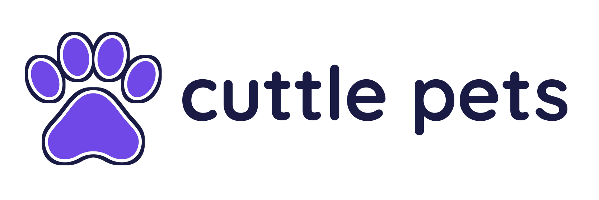
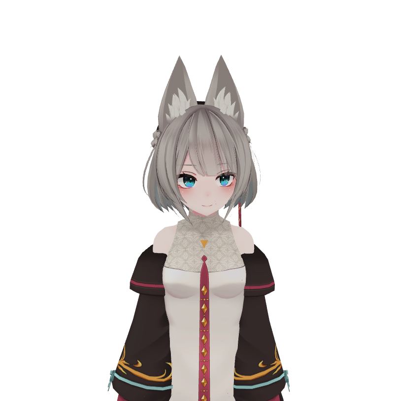
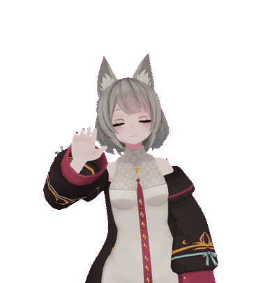
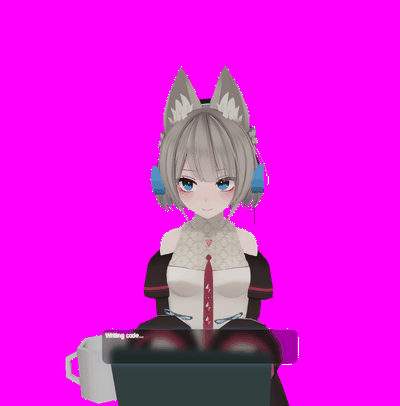
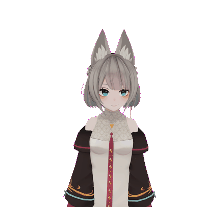
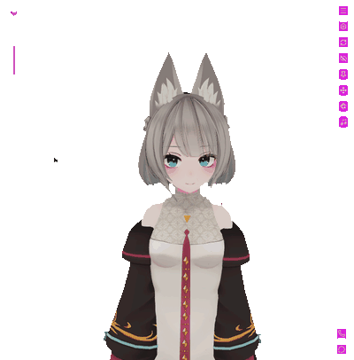
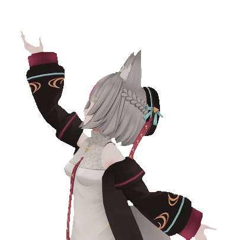
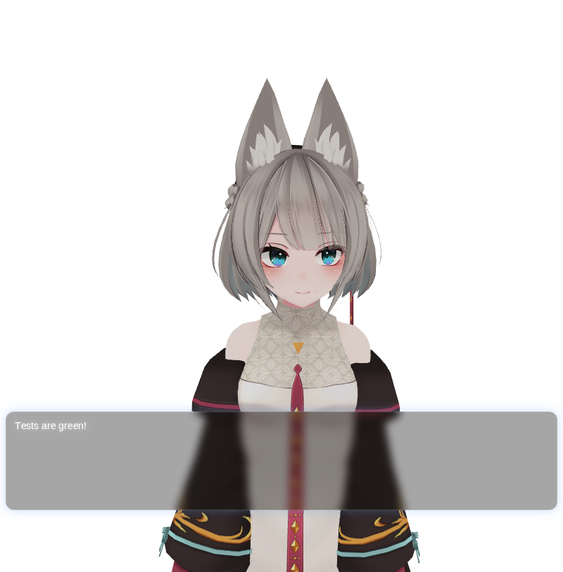
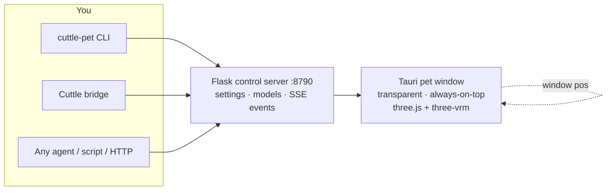

<div align="center">



**A transparent, always-on-top 3D desktop pet that reacts to your coding agents in real time.**

When Cuttle works, she types. When it's done, she cheers. When tests go green, she tells you.

[What she does](#what-she-does) · [Quick start](#quick-start) · [Any agent can drive her](#any-agent-can-drive-her) · [Architecture](#architecture) · [Control API](#control-api) · [Models & animation](#models--animation) · [Settings](#settings) · [Music & beat tracking](#music--beat-tracking) · [Windows](#windows) · [Development](#development)

[](LICENSE.txt) [](#requirements) [](#requirements) [](#requirements)

<br>



</div>

> [!NOTE]
> **A companion to [Cuttle](https://github.com/kidchemical/Cuttle), not a part of it.** The pet is a separate app with no dependency on the Cuttle daemon — it keeps running even if Cuttle restarts. It also works fully standalone: any agent, script, or shell can drive it over HTTP or the CLI.

## What she does

| Moment | Reaction |
| --- | --- |
| Agent starts thinking | Ponders, types at her tiny laptop |
| Agent streams code | Typing pose with laptop, coffee mug, and speech bubble |
| Work finishes | Cheers, waves, or dances |
| Tests go green | Tells you in a speech bubble |
| Music plays on your desktop | Headphones on, beat-synced nod (Ubuntu/PipeWire or Windows/WASAPI) |
| Your cursor moves | Eyes and head follow it |
| You lock the screen | Steps away — render loop stops, window hides |

<div align="center">

| Wave hello | Typing while you work |
| --- | --- |
|  |  |

| Music reactions | She watches your cursor | Dance break |
| --- | --- | --- |
|  |  |  |



<sub>Captured from a live pet against a transparent background. Swap in your own VRM model and she keeps every trick.</sub>

</div>

## Quick start

She is three parts: a Python **control server** on `127.0.0.1:8790`, a Tauri **pet window** (three.js + VRM), and an optional **Cuttle bridge** that turns agent activity into reactions.

### Requirements

- **OS:** Linux (tested), Windows 10/11, or macOS
- **Python 3.11+** — Flask, NumPy (and SoundCard on Windows for beat tracking)
- **Node 20+** — the renderer and the Tauri CLI
- **Rust (cargo)** — the Tauri host; `npm run tauri dev` compiles the native window
- **Windows only:** the MSVC C++ build tools and the WebView2 runtime (see [Windows](#windows))
- A `.vrm` model — author one free in [VRoid Studio](https://vroid.studio), or import your own
- Optional: Cuttle running locally, if you want her to react to agent chats

### Install and run

**Linux / macOS** — from the repository root:

```bash
python3 -m venv .venv
.venv/bin/pip install -r requirements.txt
cd app && npm install && cd ..
bash start_pet.sh                      # server + bridge + pet window
```

`start_pet.sh` builds the Tauri dev window on first run (the initial Rust compile takes a few minutes). Set `CUTTLE_PET_BRIDGE=0` to skip the bridge.

**Windows** — full prerequisite walkthrough in [Windows](#windows). Once Rust, Node, and Python are installed, from the repository root:

```powershell
python -m venv .venv
.\.venv\Scripts\pip.exe install -r requirements.txt
cd app; npm install; cd ..
powershell -ExecutionPolicy Bypass -File .\start_pet.ps1
```

### Try it

```bash
python3 cli/cuttle_pet.py status
python3 cli/cuttle_pet.py say "Hello!" --emotion happy
python3 cli/cuttle_pet.py emote surprised --intensity 0.8
python3 cli/cuttle_pet.py action greeting
python3 cli/cuttle_pet.py event thinking --detail "Reading three files…"
python3 cli/cuttle_pet.py event done --detail "Test complete!"
python3 cli/cuttle_pet.py watch      # stream pet events to stdout
```

You can also run the parts by hand:

```bash
python3 server/server.py                       # control server only
cd app && npm run tauri dev                     # pet window only
```

## Any agent can drive her

The control surface is plain HTTP plus a stdlib-only Python CLI — no Cuttle, no API keys, no SDK. If your agent can run a shell command, it can pet:

```bash
# Claude Code, Codex, Muse Code, OpenCode, Cursor, … — all the same:
python3 cli/cuttle_pet.py event thinking --detail "Refactoring auth…"
python3 cli/cuttle_pet.py event done --detail "Ship it!"
```

or raw HTTP from any language:

```bash
curl -X POST http://127.0.0.1:8790/pet/event \
  -H 'Content-Type: application/json' \
  -d '{"state":"done","detail":"Deploy finished"}'
```

CLI exit codes are script-safe (`0` on success), so agents can chain commands reliably. The Cuttle bridge below is just one opinionated driver — bring your own for any other harness.

## Architecture



| Path | Purpose |
| --- | --- |
| `app/` | Tauri + React + three.js renderer (vendored from [claw-sama](https://github.com/luckybugqqq/claw-sama), MIT — see `app/VENDORED.md`) |
| `server/server.py` | Flask control server — the only thing the pet window talks to |
| `cli/cuttle_pet.py` | `emote` / `action` / `say` / `event` / `click-through` / model import |
| `bridge/` | Polls Cuttle live-status and drives pet reactions |
| `~/.cuttle-pet/` | Your data (never shipped): `models/` (`.vrm` library), `pets/` + `props/` (imported GLBs), `settings.json` |
| `scripts/autostart.py` | Linux desktop-login autostart |

## Cuttle bridge

The bridge watches **all chats on your Cuttle account** (batched, every 3 seconds) and turns activity into reactions: thinking → ponders, streaming → types, done → celebrates, then back to idle. It's an activity indicator — it never reads or speaks full replies.

```bash
bash start_pet.sh   # includes the bridge
```

Then open the pet's **Settings → Cuttle → Connect to Cuttle** and sign in once with your normal Cuttle username and password. The pet keeps a separate login session (owner-only file, token not password) and reconnects itself after reboots. Restrict to specific chats when you want:

```bash
python3 bridge/bridge.py --session 868 --session 869 --verbose
CUTTLE_PET_BRIDGE=0 bash start_pet.sh   # no bridge, direct CLI control only
```

## Control API

The server is plain HTTP on `127.0.0.1:8790` — anything can drive her:

| Verb | Effect |
| --- | --- |
| `GET /events` | **SSE** — the only inbound channel to the pet |
| `POST /emote` | `emotion`, `emotionIntensity`, `emotionDuration` — set expression |
| `POST /action` | `action`, `hold` — play a named animation |
| `POST /say` | `text`, `emotion` — speech bubble + lip-sync |
| `POST /pet/event` | `state` (`thinking`/`streaming`/`done`/`error`/`idle`) + `detail` — chat-activity reaction |
| `POST /clear` | Clear the bubble |
| `POST /click-through` | Toggle mouse pass-through |
| `GET/POST /settings` | Renderer settings store |
| `GET /model/list`, `POST /model/import` | Manage models |
| `GET /behaviors` | Agent-browsable library of user-defined custom reactions |
| `POST /behaviors/trigger` | Play a reaction by `id` with optional `params` (or an inline `reaction` draft) |

Emotions: `happy sad angry surprised think awkward question curious neutral love flirty greeting relaxed`.
Actions: `akimbo playFingers scratchHead stretch happy angry greeting excited shy point salute angryPump`, plus Mixamo and Quaternius dance packs.

## Models & animation

Use **VRM** (`.vrm`) — export free from [VRoid Studio](https://vroid.studio), or from Unity via [UniVRM](https://github.com/vrm-c/UniVRM) (MIT). Import with `cuttle-pet models --import file.vrm`.

Bundled motion: 10 Mixamo clips (Adobe free account terms), the CC0 [Quaternius](https://quaternius.com) animation libraries (sitting, talking, phone call, dance), and CC0 hand props (laptop, phone, coffee cup — the cup appears for a ~4s sip every minute or so of sustained work). Beat sync nods along to your music via PipeWire on Ubuntu or WASAPI output loopback on Windows, with MPRIS playback-state fallback on Linux — headphones appear automatically while music plays, including during typing.

Full provenance for every bundled binary lives in [`docs/ASSET_LICENSES.md`](docs/ASSET_LICENSES.md) — code is MIT, assets keep their own terms.

## Window & desktop

Transparent, always-on-top, no decorations, skipped taskbar — drag her anywhere, Tab folds the menu, F4 settings, F5 reload. Position restores on launch (Xwayland shim on Wayland). She pauses her render loop and hides on screensaver/lock.

**Always-on-top is the default** and stays that way across restarts. To toggle it: click the pin button in the pet toolbar, or from any script:

```bash
python3 cli/cuttle_pet.py settings pinned false   # unpin
python3 cli/cuttle_pet.py settings pinned true    # pin again
```

Enable login autostart (Linux) with `python3 scripts/autostart.py enable`.

### Linux / NVIDIA graphics

With the NVIDIA driver loaded, the app keeps WebKitGTK's DMA-BUF renderer but forces shared-memory buffers (`WEBKIT_FORCE_DMABUF_RENDERER=1`, `WEBKIT_DMABUF_RENDERER_FORCE_SHM=1`). NVIDIA's GBM rejects the renderer's hardware buffers, which otherwise shows a blank window or crashes; the older workaround, `WEBKIT_DISABLE_DMABUF_RENDERER=1`, avoids that but falls back to non-composited CPU painting, which held a large pet window near 25 fps where shared-memory buffers reached about 60 fps at lower CPU. Setting any of these three variables yourself overrides the default (for example `WEBKIT_DISABLE_DMABUF_RENDERER=1` restores the old fallback). See [Tauri's Linux graphics notes](https://v2.tauri.app/develop/debug/linux-graphics/). With NVIDIA the app also defaults `__GL_YIELD=USLEEP`: the driver otherwise busy-waits on every WebGL frame and keeps a full CPU core busy even for an empty scene. An explicit `__GL_YIELD` value overrides it.

## Settings

Open **Settings** from the pet toolbar, tray menu, or **F4**. Settings opens in a
separate, resizable desktop window, independent of the pet viewport. Changes apply
live and are saved locally and to the control server. Opening Settings again restores
and raises the existing window, keeping its position; new windows start centered. In
the desktop app, drop files anywhere on **Model**, **Animations**, **Pets**, or
**Props** to import into that page's library; the file-picker buttons use the same
import paths. Model accepts VRM, Animations accepts VMD/VRMA/FBX and matching MP3
music, and Pets/Props accept GLB/glTF/FBX/DAE (converted to GLB when needed).
Settings explanations live behind **ⓘ** icons, shown on hover, keyboard focus or tap.

- **Pets** — **Lighting fill** lifts shadows using the stage's brightness and color (switching all stage lights off also removes this fill, letting cursor lights shade the pet). **Limb motion** and **Follow lag** control procedural bone motion and how loosely a companion trails its anchor. Float idle adds gentle sideways/depth drift and rotation; set limb motion to zero to keep the imported bind pose.
- **Quality** — **Frame rate limit** caps FPS from 15–240 or **Uncapped**, separately from visual presets. The cap is an upper limit; actual FPS also depends on the webview's frame clock and graphics workload. On Linux, an unsupported DRM vblank query uses a native software clock paced to the current monitor, avoiding WebKitGTK's fixed 60 Hz fallback. `python3 cli/cuttle_pet.py stats` reports rendered FPS, browser callback rate, native paints, monitor refresh, callback gaps, and frame work — see [frame pacing diagnostics](.cuttle/docs/frame-pacing.md). While resizing, the pet briefly uses a 30 FPS budget and returns to the selected limit 250 ms after resizing stops.
- **Display** — **Text speed** changes how quickly speech and status text appear (0.25–8× or **Instant**; does not change audio playback).
- **Animations** — a global speed multiplier plus a searchable, scrollable list of idle, gesture, dance, imported, and procedural animations. Select one to adjust its individual speed (effective speed is global × individual). Clips have a transition duration and gestures a held-pose duration. **Anchor feet to floor** is a per-clip toggle that lowers the hips to keep the lowest foot, toe, or knee on the model's floor; it defaults on for **Pray**, **Sitting idle**, and **Sitting talk**, while jumps and dances keep their authored vertical motion. Use **Preview on pet**, **Stop preview**, and the reset buttons to try changes. At effective speeds below 0.0625×, dance audio stays at 0.0625× (the browser's minimum playback rate).
- **Behavior** — owns all automatic action timing: Idle surprises, Working coffee sips, Music dance breaks, and each state's Start / Main / Occasionals / End. Referenced behaviors in Start, End, or Occasionals play Start → one weighted Main → End once, then resume the current state; Main references sustain another behavior. Clips finish naturally; one-shot procedural motions use the configurable hold time (5 seconds by default). Circular references are skipped. Turning the engine off stops automatic sequences and occasionals; manual previews still work.
- **Custom reactions** — one-shot behaviors any agent can call by id, e.g. a `rocket-launch` celebration after a git push. Each reaction is an ordered step sequence (animation + emotion + speech + laptop/coffee props) with typed parameters referenced as `{{name}}` in speech text. Agents browse the library with `python3 cli/cuttle_pet.py behaviors` (`GET /behaviors`) and play one with `python3 cli/cuttle_pet.py react rocket-launch --param message="Shipped!"` (`POST /behaviors/trigger`). Reactions play once and the pet returns to its current state; the four persistent states (idle / working / music / dancing) stay fixed.

Currently playing entries on both settings pages show a mint gradient, a gentle glow, and a Playing badge. Blue marks the entry selected for editing. Nested behaviors highlight both the invoking entry and the currently playing step; reduced-motion preferences use a static highlight. Settings show the latest real playback snapshot immediately when available, request a fresh snapshot on opening, and show “Connecting to pet…” while waiting.

**Settings migration:** `behaviorSettings.version: 2` moves the legacy `musicSettings.randomDance` and `musicSettings.reactOnEnd` toggles into explicit Music Occasionals and End entries in the current and saved behavior profiles (enabled legacy dance breaks become a Dancing occasional; enabled end reactions become a clapping End entry). Existing entries are preserved and disabled toggles add nothing. Migration runs once and saves only the `behaviorSettings` preference through a merge patch; other preferences, model files, dances, and audio are untouched.

## Music & beat tracking

Install Python dependencies with `python -m pip install -r requirements.txt`. NumPy runs the shared detector on both platforms. Windows additionally installs SoundCard (and CFFI) through the platform-specific requirement; Ubuntu requires `pw-record` and `wpctl` from PipeWire/WirePlumber.

The detector combines bass, midrange, and treble spectral changes, estimates tempo from eight seconds of recent rhythm evidence, and tracks a continuous beat grid. Musical onsets provide evidence; only tracked grid pulses steer the pet's phase. New settings default to 60–200 BPM; existing saved minimum/maximum bounds remain in effect. The bass-band control changes one analysis band, rather than rejecting all higher-frequency rhythm. Sensitivity controls onset admission.

Music settings show a large live BPM estimate: yellow while calculating, green when locked. If rhythm evidence drops out, the last estimate stays visible and is labeled accordingly. Analysis controls come first, followed by motion and per-model headphone fitting.

Audio stays local in memory; microphones are never selected. Windows captures multiple playback channels and downmixes/resamples them internally, avoiding SoundCard's documented single-channel WASAPI issue. Output-device changes and capture errors cause a reconnect and reset the tracker. Windows playing status comes from audio signal presence, so all desktop audio can activate music mode; there is no native per-player media-session fallback. Mono-only Windows output endpoints are currently unsupported by the SoundCard backend.

Music without a clear pulse can remain unlocked. Half/double tempo and beat-phase ambiguity remain possible; the bounds and manual fallback are available in Music settings. Confidence is a rhythm-stability heuristic, not a probability. Acquisition time differs from steady-state phase accuracy. Hardware capture latency and audible output delay (especially Bluetooth) require testing on the target device; sub-120 ms end-to-end latency is not guaranteed.

Third-party license notices are in [THIRD_PARTY_NOTICES.md](THIRD_PARTY_NOTICES.md).

## Windows

The launcher needs more than the Python requirements: `npm run tauri dev` also compiles the **Rust** host, so `cargo` must be on `PATH` or `start_pet.ps1` stops with `cargo is required`.

1. **Install the prerequisites once** (any PowerShell):

   ```powershell
   winget install Python.Python.3.12
   winget install OpenJS.NodeJS.LTS
   winget install Rustlang.Rustup
   winget install Microsoft.VisualStudio.2022.BuildTools
   winget install Microsoft.EdgeWebView2Runtime
   ```

   Prefer installers from the source? [Python](https://www.python.org/downloads/), [Node.js LTS](https://nodejs.org/), [Rust via rustup](https://rustup.rs). Tauri's Windows build additionally needs the **MSVC C++ build tools** (Visual Studio 2022, "Desktop development with C++" workload) and the **WebView2 runtime** — see [Tauri's prerequisites](https://v2.tauri.app/start/prerequisites/). Close and reopen the terminal after installing so `cargo` and `node` are on `PATH`; verify with `rustc --version` and `node --version`.

2. **Set up the repo** (from the repository root):

   ```powershell
   python -m venv .venv
   .\.venv\Scripts\pip.exe install -r requirements.txt
   cd app; npm install; cd ..
   ```

3. **Launch** (server, bridge, then the Tauri dev window):

   ```powershell
   powershell -ExecutionPolicy Bypass -File .\start_pet.ps1
   ```

`start_pet.ps1` mirrors `start_pet.sh`: it reuses a running control server, starts the bridge unless `$env:CUTTLE_PET_BRIDGE` is `'0'`, then opens the Tauri dev window. The first run compiles Rust and takes a few minutes. Release binaries are planned; dev-window launch for now.

## Development

Coding agents: start with [AGENTS.md](AGENTS.md) for source entry points, validation
commands, and native mouse-input regression guidance.

```bash
python3 -m pytest tests/          # Python suite (server, bridge, beats, CLI)
cd app && npx tsc --noEmit        # renderer typecheck
```

Animation regression tests (from the repository root):

```bash
app/node_modules/.bin/tsx tests/animation_settings.test.ts
app/node_modules/.bin/tsx tests/preferences.test.ts
app/node_modules/.bin/tsx tests/companion_runtime.test.ts
# Optional browser smoke test; install Playwright + Chromium, and start Vite first:
npm --prefix app run dev -- --port 1431
# In another terminal:
python tests/browser/settings_window.py --base-url http://127.0.0.1:1431
python tests/browser/settings_imports.py --base-url http://127.0.0.1:1431
python tests/browser/text_bubble.py --base-url http://127.0.0.1:1431
python tests/browser/music_polling.py --base-url http://127.0.0.1:1431
python tests/browser/render_readback.py --base-url http://127.0.0.1:1431
python tests/browser/companion_lighting.py --base-url http://127.0.0.1:1431
```

The settings browser smoke test mocks all pet-server calls, checks persistence and
live window synchronization, and saves screenshots under `temp/`. The polling test
checks that BPM updates leave the fitting controls idle and stop on unmount. The
render test exercises real WebGL alpha readbacks, screenshots, and teardown with
native window operations mocked; it does not verify desktop input delivery or
hardware frame-rate gains.

## License

MIT. See [`LICENSE.txt`](LICENSE.txt). The renderer in `app/` is upstream [claw-sama](https://github.com/luckybugqqq/claw-sama) work under MIT — `app/UPSTREAM-LICENSE.txt` stays intact. Bundled models, motions, and props keep their own terms ([asset licenses](docs/ASSET_LICENSES.md)).
